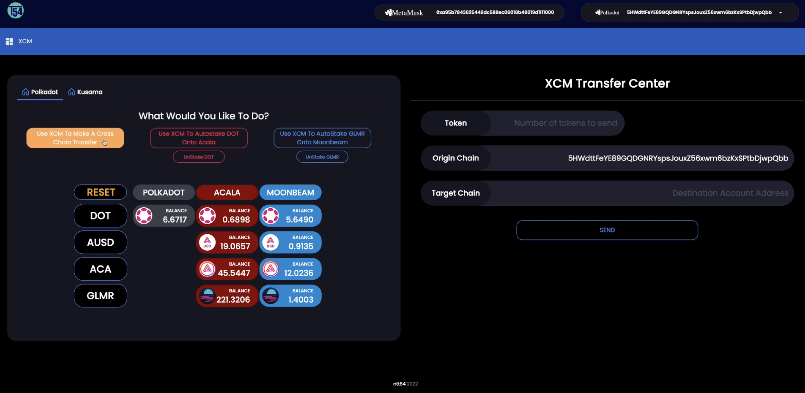
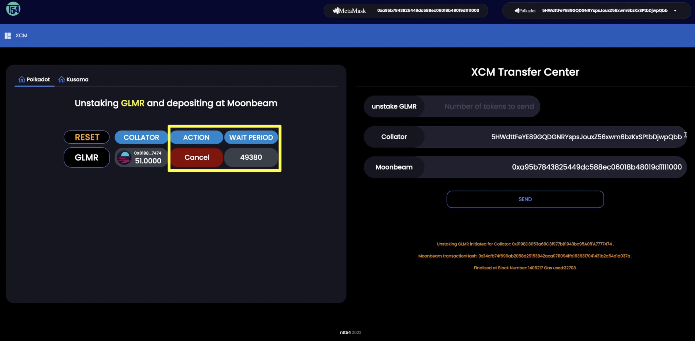

## Please use at your own risk. This a submission for bounty, not production/battle-tested and audited software.

<br>

# __Polkadot Hackathon: North America Edition__
## Acala Bounties - Cross-Parachain Dapp
## Moonbeam Challenge - Build a XCM related Tool for Moonbeam

<br>


<br>

## Table of Contents
1. [General Info](#general-info)
2. [Website](#website)
3. [Acala Bounty - DOT Demo Video](#acala-bounty-demo-video)
4. [Moonbeam Bounty - GLMR Demo Video](#moonbeam-bounty-demo-video)
5. [Installation](#installation)
6. [Using the Front End](#using-the-front-end)
    * [Use XCM to Make a Cross Chain Transfer](#use-xcm-to-make-a-cross-chain-transfer)
        * [Acala Bounty - Use XCM to Autostake DOT onto Acala](#use-xcm-to-autostake-dot-onto-acala)
        * [Acala Bounty - Unstake DOT from LDOT on Acala](#unstake-dot-from-ldot-on-acala)
        * [Moonbeam Bounty - Use XCM to Autostake GLMR onto Moonbeam](#use-xcm-to-autostake-glmr-onto-moonbeam)
        * [Moonbeam Bounty - Unstake GLMR from Moonbeam](#unstake-glmr-from-moonbeam)


<br>

## General Info
***
<p>This repo contains a DApp that allows the user to perform XCM staking and transfer operations across the Polkadot mainnet ecosystem.</p>

<br>

### __Activities__
***
1. __Transfer and AutoStake DOT from any supported parachain to Acala LDOT__
2. __Unstake existing DOT from LDOT at Acala__ 
3. __Transfer and AutoStake GLMR from any supported parachain to Moonbeam__
4. __Unstake existing GLMR from Moonbeam__ 
5. __Multi-chain asset transfers between self-owned accounts__
6. __Multi-chain asset transfers between one account and another account__ 
7. __Track all of your asset balances across supported parachains__ 

<br>

### Supported Chains and Assets
***
### __Polkadot Ecosystem__
1. __Parachains__ 
    * ACALA
    * MOONBEAM
2. __Assets__
    * DOT
    * ACA
    * AUSD
    * GLMR

<br>

### Website
***
<p>
We have deployed a website 
<a href="https://hidden-fjord-81174.herokuapp.com/" target="_blank">here</a>
to showcase our application and hackathon bounty submissions.
</p>
<p>
Please make sure you have the Polkadot wallet chrome extension installed.
</p>
<p>
Please make sure you have the Metamask wallet chrome extension installed and connected to Moonbeam parachain.
</p>
<p>
The website is best viewed on screen resolutions above 2560x1440px. 
Any future versions will accomodate responsive frameworks + mobile.
</p>
<br>

### Acala Bounty Demo Video
***
<p> A demo video showing the features of DOT Staking, Unstaking and XCM transfers in our application can be found 
<a href="https://www.youtube.com/watch?v=kvjyT3BvJp8" target="_blank">here</a>.

This shows our work on the project for our submission for the Acala bounty. Please check it out!


### Moonbeam Bounty Demo Video
***
<p> A demo video showing the features of GLMR Staking, including the various stages of Unstaking and XCM transfers in our application can be found 
<a href="https://www.youtube.com/watch?v=ol0bFTPKFGg" target="_blank">here</a>.

This shows our work on the project for our submission for the Moonbeam bounty. Please check it out!

</p>
<br>

### Installation
***
Create a new folder and inside it
```bash
$ git clone https://github.com/Entity54/StakePolkadotXCM
$ cd StakePolkadotXCM
$ yarn
$ npm start
```

<br>

### Using The Application 
***
<p>
Welcome to XCM DOT AUTOSTAKE. 
<p>
To begin with you must ensure you connect and approve the Polkadot.js and Metamask extension pop ups when interacting with this website. 
Please also ensure that Metamask is connected to the Moonbeam chain. 
</p>
<p>
You can see the Polkadot and Metamask accounts to be used at the top of the screen. 
If another Polkadot account is desired, please choose from the top right dropdown (and for metamask choose directly within your metamask extension).
</p>
<p>
Upon visiting the DApp, you can see that the screen is divided into two main sections: 

* The left side of the screen is where all of the instructions and choices are made by the user.
* The right side of the screen is where all of the required transaction information is automatically prefilled before the transaction is eventually submitted.
<p>
As soon as the accounts are connected, the balances of these accounts are loaded and displayed across all assets and parachains.

For example, looking at the DOT asset in the first column, reading across that row, we can see our DOT balance on the Polkadot chain, the Acala chain and the Moonbeam chain.
</p>

<p>To use the DApp you must start at the top, where you are presented with five options to choose from:

__Buttons__
* Use XCM to Make a Cross Chain Transfer
* Use XCM to Autostake DOT Onto Acala
* Unstake DOT
* Use XCM to Autostake GLMR Onto Moonbeam
* Unstake GLMR

<br>


<br>


## Use XCM to Make a Cross Chain Transfer

<p>Lets try the first option. </p>
<p>
Click "Use XCM To Make A Cross Chain Transfer".
</p>
<br>


<br>

<p>
<br>
The dashboard on the left part of the screen now unlocks and you are presented with instructions to "Select the Asset To Transfer" 

</p>
<br>


<br>


<p>
Choose an asset from the first column e.g. AUSD. 

This will be highlighted in orange and only the row of that asset will remain visible to emphasize the next available options. 

On the right side of the screen the "Token" field is automatically prefilled with your selection, "AUSD".
</p>
<br>


<br>

<p>
Next, select the origin chain that you want to transfer the AUSD "from", for example Acala. This is now also highlighted in orange.

On the right side of the screen:
* The "Origin Chain" field is automatically prefilled with the selection, "Acala".
* The correct address format of the user's substrate account for the chosen origin chain is prefilled. 
* The maximum available balance of the selected asset at the chosen Origin chain is prefilled in the quantity field. The user can of course edit this if they wish to transfer a different amount.

We will transfer 5 AUSD.

Meanwhile on the left side of the screen, a check is made and the remaining tabs on the row of the selected asset will only remain visible depending on whether the relevant HRMP channel is available or not to transfer the selected asset.
The reason for this is that currently some parachains do not support receiving "secondary" or "non-native" assets. 
<br>
<br>


<br>


</p>
<br>

<p>
Next, select the destination chain you want to transfer the AUSD "to", for example, lets choose Moonbeam. This tab is now also highlighted in orange.

On the right side of the screen:
* The "Destination Chain" field is automatically prefilled with the selection, "Moonbeam".
* The correct address format of the user's substrate account for the chosen destination chain is prefilled.
* The user can of course choose to send their asset to any address but as a default this is prefilled with their own address at the destination parachain.
</p>
<br>


<br>


> TIP:  If the user clicks again or clicks "Reset" the webpage will reset to the intial configuration.


<br>
<p>
That's it! 

Click Send and sign the transaction when the Polkadot Wallet Extension appears.
</p>
<br>


<br>
<br>
The user is immediately notified that the XCM transfer has been submitted.
</p>

<br>
<p>
As soon as the Origin and Destination parachains mine the relevant transactions, the origin chain Extrinsic Hash, Block Hash and XCMP message are displayed on the screen.
</p>
<p>
Lastly, on the left you can see the transfer of assets as the balances on the different parachains are updated.
</p>
<br>


<br>

<br>
<br>

## Use XCM to Autostake DOT onto Acala

<p>Next, lets try the Autostake DOT feature using XCM.</p>
<p>
It is possible to transfer DOT using XCM from any of the supported chains to Acala and then stake it there for LDOT.
</p>
<br>
<p>
Lets see an example of how to transfer DOT from Polkadot to Acala and then autostake it for LDOT.
</p>

<p>
Click "Use XCM To Autostake DOT Onto Acala
</p>
<br>


<br>
<br>
<p>
The dashboard on the left side of the screen now unlocks showing only the DOT asset row.

On the right side of the screen the "Token" field is automatically prefilled with your selection, "DOT". 
</p>

<br>


<br>


<p>
The user selects the origin chain that they want to transfer their DOT from,for example Polkadot. This is then highlighted in orange.

On the right side of the screen:
* The "Origin Chain" field is automatically prefilled with the selection, "Polkadot".
* The correct address format of the user's substrate account for the chosen origin parachain is prefilled. 
* The "Destination Chain" field is automatically prefilled with the selection, "Acala".
* The correct address format of the user's substrate account for the Acala parachain is prefilled.
* The maximum available balance of the selected asset at the chosen Origin chain is also prefilled in the quantity field. 
* The user can of course edit this amount if they prefer to transfer a different amount but it must be noted that the minimum staking quantity for DOT on Acala is 5 DOT plus a small amount to cover the fees. 

<p>
We will transfer 5.5 DOT.
<br>
<br>
</p>


<br>

<br>
<p>
That's it! Click send and sign the two transactions when the Polkadot Wallet Extension appears. 

The first transaction to sign is for the XCM transfer from Polkadot.

The second transaction to sign is for staking your DOT at Acala automatically once it arrives at the Acala parachain.

The user is immediately notified that their XCM transfer transaction has been submitted.
</p>

<p>

As soon as the Origin and Destination parachains mine the relevant transactions, the relevant information is displayed:
* XCM Message Hash
* Origin chain Extrinsic Hash
* Block Hash
* Origin Fees
* Destination Fees
* Net Deposited Amount
 
In addition, the Staking DOT Extrinsic Hash at Acala, the Block Hash at Acala and the updated Free LDOT balance are also displayed.
</p>
<p>
Lastly, the balances diplayed on the two chains are updated on the screen.
</p>
<br>


<br>

<br>
<br>

## Unstake DOT from LDOT on Acala

<p>Now lets see how to unstake DOT from LDOT and so that the free DOT on Acala is available to transfer via XCM.
<p>
Click "UnStake DOT" at the top of the screen.
</p>
<br>


<br>

<p>
The Token field on the right hand side is prefilled with "LDOT=>DOT" and the available balance of LDOT to unstake is also prefilled. 

The Origin and Destination chains are prefilled with Acala along with the user's account in the Acala address format.
</p>

<br>


<br>

<p>
That's it! Click send and sign the transaction.

Once the Acala parachain mines the unstaking transaction, the Extrinsic Hash, Block Hash and updated LDOT balance is displayed on the screen.

Lastly, the balances displayed are updated to reflect the changes. 
</p>
<br>


<br>

<br>

## Use XCM to Autostake GLMR onto Moonbeam

<p>Next, lets try the Autostake GLMR feature using XCM.</p>
<p>
It is possible to transfer GLMR using XCM from any of the supported chains to Moonbeam and then stake it there.
</p>
<br>
<p>
Lets see an example of how to transfer GLMR from Acala to Moonbeam and then autostake it.
</p>

<p>
Click "Use XCM To Autostake GLMR Onto Moonbeam.
</p>
<br>


<br>
<br>
<p>
The dashboard on the left side of the screen now unlocks showing only the GLMR asset row.

On the right side of the screen the "Token" field is automatically prefilled with your selection, "GLMR". 
</p>

<br>


<br>


<p>
The user selects the origin chain that they want to transfer their GLMR from,for example Acala. This is then highlighted in orange.

On the right side of the screen:
* The "Origin Chain" field is automatically prefilled with the selection, "Acala".
* The correct address format of the user's substrate account for the chosen origin parachain is prefilled. 
* The "Destination Chain" field is automatically prefilled with the selection, "Moonbeam".
* The correct address format of the user's EVM account for the Moonbeam parachain is prefilled.
* The maximum available balance of the selected asset at the chosen Origin chain is also prefilled in the quantity field. 
* The user can of course edit this amount if they prefer to transfer a different amount but it must be noted that the minimum staking quantity for GLMR on Moonbeam is 50 GLMR plus a small amount to cover the fees. 

We will transfer 51 GLMR.

<br>


<br>
<br>
<p>

Lastly, we need to choose an active collator to stake the funds with on the Moonbeam network.
Upon selecting a collator from the candidate list dropdown box, the collator field on the right side of the screen is also prefilled with the chosen selection.
<br>
<br>

</p>
<br>
<p>
That's it! 

Click send and sign the first transaction for the XCM transfer from Acala to Moonbeam when the Polkadot Wallet Extension appears. 

The user is immediately notified that their XCM transfer transaction has been submitted.

Once this transaction has mined, sign the second transaction when the Metamask Wallet Extension appears to allow the staking of your GLMR at the Moonbeam parachain.

As soon as the Origin and Destination parachains mine the relevant transactions, the relevant information is displayed:
* XCM Message Hash
* Origin chain Extrinsic Hash
* Block Hash
* Origin Fees
* Destination Fees
* Net Deposited Amount
 
In addition, the Staking GLMR Extrinsic Hash at Moonbeam, the Block Hash at Moonbeam and the staked GLMR balance are also displayed.
</p>
<p>
Lastly, the balances displayed on the two chains are updated on the screen.
</p>
<br>


<br>

<br>

## Unstake GLMR from Moonbeam

<p>Now lets see how to unstake GLMR from Moonbeam so that the free GLMR on Moonbeam is available to transfer via XCM.
<p>
Click "UnStake GLMR" at the top of the screen.
</p>
<br>


<br>

<p>
On the left side of the screen all of our current stakings are displayed.

Each row represents a different collator with whom the user has staked GLMR with. 

The collator column is display only and shows the collators address along with the amount of GLMR that is currently staked with them.

The Action column is clickable and displays the three different states of the unstaking process.

Before starting the unstaking process this column will display "Unstake".

Upon clicking the Unstake button, the status is changed to "Cancel".

On the right side of the screen the Token field is prefilled with "Unstake".

The chain is prefilled with Moonbeam along with the user's account in the Moonbeam EVM address format.

The Collator field is prefilled with the address of the collator that you have selected and the available balance of GLMR the user has available to unstake with that Collator is also prefilled. 

Now click Send and sign the transaction when the Metamask Wallet Extension appears to allow the unstaking process of your GLMR to begin on the Moonbeam parachain.

Once the transaction has been mined you will see the Wait Period column on the left of the screen change its status from "Not Initiated" to showing a continuous block countdown until the staked GLMR is available to be claimed.

</p>

<br>


<br>

<p>


When the countdown reaches zero, the Action column will change from "Cancel" to "Claim".

The user can then click the claim button, then click Send and sign the transaction when the Metamask Wallet Extension appears to complete the unstaking of the GLMR from that Collator on the Moonbeam parachain.

Once the Moonbeam para chain mines the unstaking transaction, the EVM transaction Hash, Block Hash and updated staked glimmer balance is displayed on the screen.
</p>
<p>
Lastly, the asset balances displayed are also updated on the screen.
</p>
<br>


<br>


